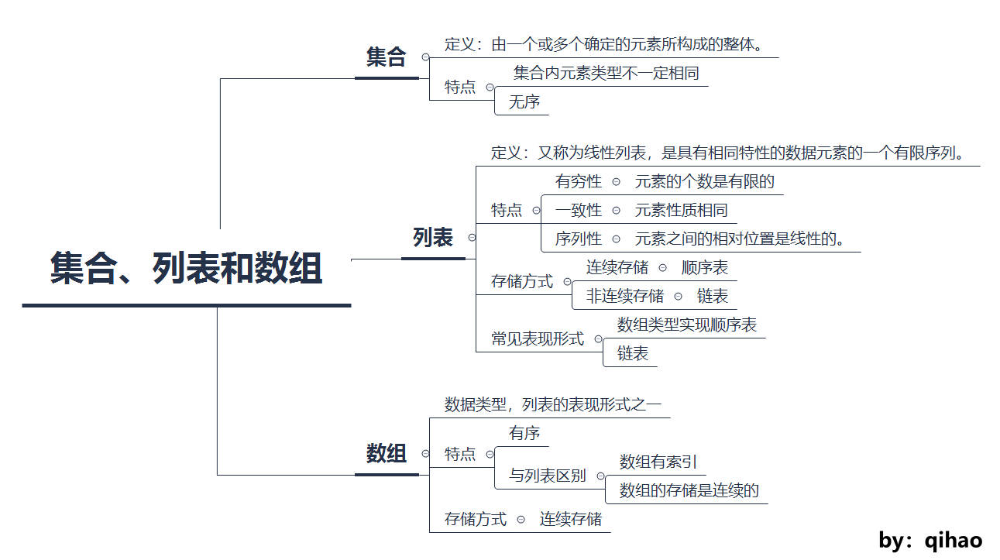
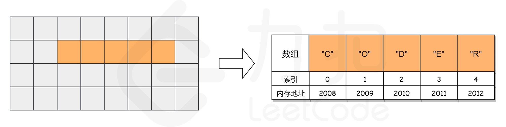

## A. 集合、列表和数组  
### 集合：  
    定义：由一个或多个确定的元素所构成的整体  
    特点：  
        1. 集合中的元素类型不一定相同  
        2. 集合里面的元素没有顺序  
    注** 事实上，这样的集合并不直接存在于编程语言中。实际编程语言中很多数据结构是在集合的基础上添加一些规则形成。  
### 列表：  
    定义：由一种类型的元素构成的有限序列，即按照一定的线性顺序，排列而成的数据项的集合。  
    特点：  
        1. 有顺序  
        2. 长度可变  
    注** 编程语言中常见的表现形式为数组和链表，栈和队列是两种特殊的列表  
### 数组：  
    定义：数组是列表的实现方式之一（另一种是链表）  
    特点：  
        1. 连续性，即内存连续  
        2. 每个元素占用相同大小内存  
        3. 使用索引访问  
        4. C++与Java中元素类型必须一致  

## B. 数组操作
    数组操作分为4种，读取、查找、插入、删除
### 读取元素
    通过索引的方式进行读取，索引一般从0开始  
    计算机会为数组分配一段连续的内存，并记下索引为0的内存地址，此地址即为数组地址。
  
    
    如果我们想访问索引为2的元素'D'，计算机会进行如下计算
    1. 获取数组内存地址，即索引为0的元素地址：2008
    2. 计算索引为2的元素地址 数组地址 + 索引值 = 2008 + 2 = 2010
    3. 数组读取的时间复杂度为O(1)

## C. 查找元素
    数组查找最简单的查找方式是顺序查找，即从0到length - 1遍历数组，直到找到指定值为止，因此最坏的情况是遍历所有元素，
    所以时间复杂度为O(N)
## D. 数据插入
    数据插入分两种情况：
    1. 数组末尾插入，这种情况的插入相对简单，只需要计算出待插入位置的地址即可。
    2. 非末尾插入，这种情况需要进行数据移动，将待插入位置及以后的数据统一向后移动一位，然后将数据插入待插入位置。
## E. 删除元素
    删除操作与插入操作相似，删除元素后会产生数据移动
    1. 删除末尾元素，这种情况无需数据移动
    2. 删除非末尾元素，此时需要进行数据移动，最坏的情况是删除索引为0的元素，这种情况需要进行 1 + (n - 1) = n次操作，
    其中1为删除，n - 1为数据移动，因此时间复杂度为O(N)