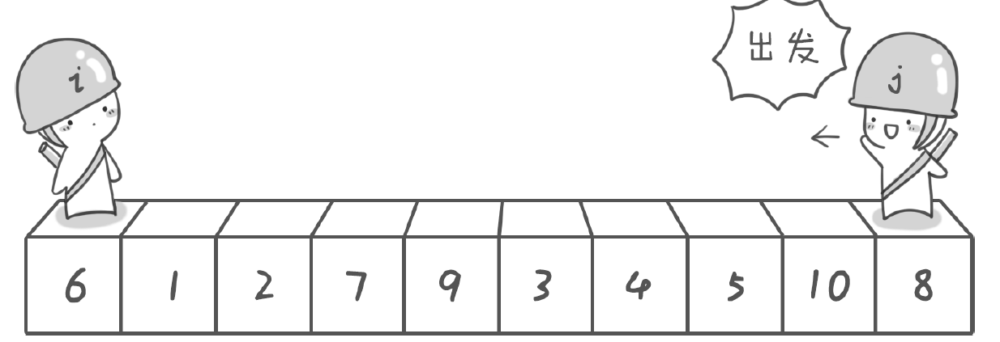
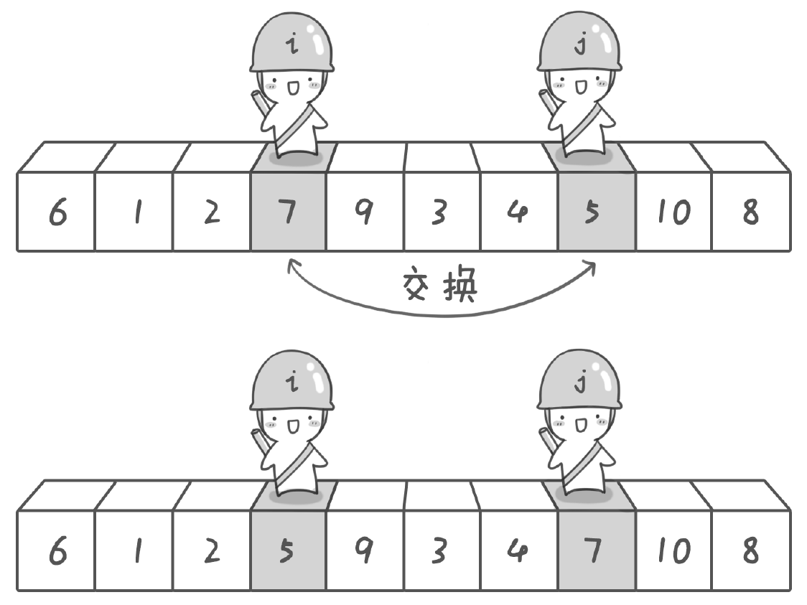
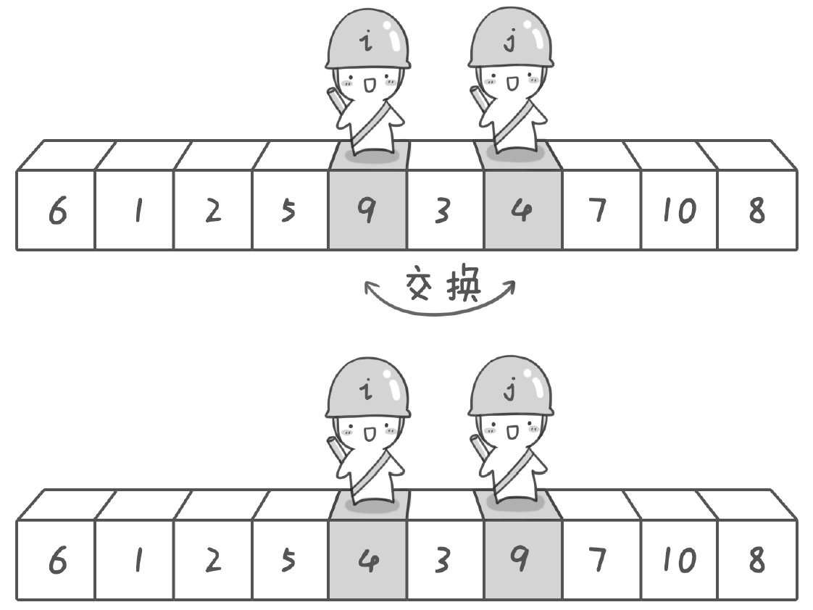
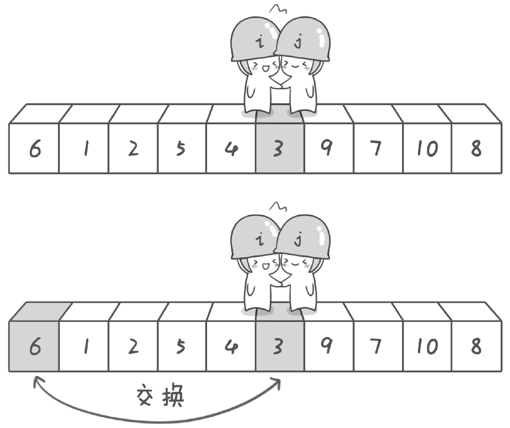
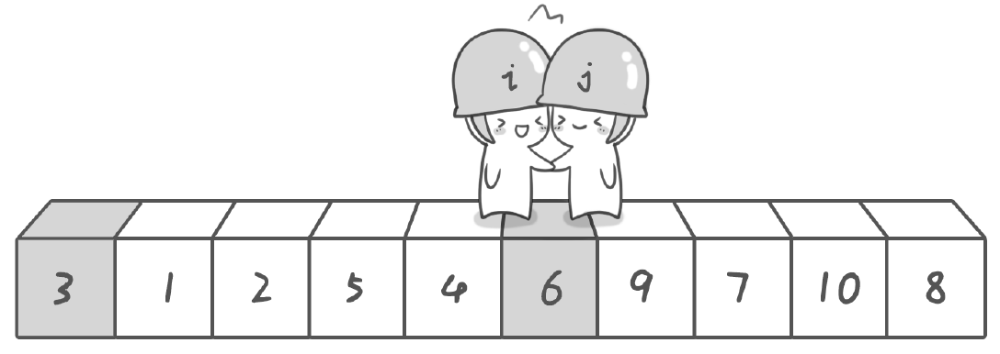
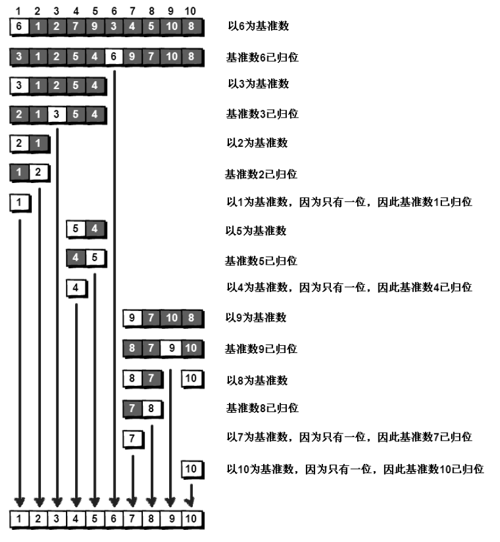

假设我们现在对“6 1 2 7 9 3 4 5 10 8”这10 个数进行排序。首先在这个序列中随
便找一个数作为 ***基准数*** 为了方便，就让第一个数6 作为基准数吧。接下来，需要将这个序列中
所有比基准数大的数放在6 的右边，比基准数小的数放在6 的左边，类似下面这种排列。

3 1 2 5 4 ***6*** 9 7 10 8

在初始状态下，数字6 在序列的第1 位。我们的目标是将6 挪到序列中间的某个位置，
假设这个位置是k。现在就需要寻找这个k，并且以第k 位为分界点，左边的数都小于等于6，
右边的数都大于等于6。

方法其实很简单：分别从初始序列“6 1 2 7 9 3 4 5 10 8”两端开始“探测”。先从
右往左找一个小于6 的数，再从左往右找一个大于6 的数，然后交换它们。这里可以用两个
变量i 和j，分别指向序列最左边和最右边。我们为这两个变量起个好听的名字“哨兵i”和
“哨兵j”。刚开始的时候让哨兵i 指向序列的最左边（即i=1），指向数字6。让哨兵j 指向序
列的最右边（即j=10），指向数字8。

首先哨兵j 开始出动。因为此处设置的基准数是最左边的数，所以需要让哨兵j 先出动，
这一点非常重要（以左边为基数的情况，如果从右边开始会出现丢数的情况）。哨兵j 一步一步地向左挪动（即j--），直到找到
一个小于6 的数停下来。接下来哨兵i 再一步一步向右挪动（即i++），直到找到一个大于6
的数停下来。最后哨兵j 停在了数字5 面前，哨兵i 停在了数字7 面前。

现在交换哨兵i 和哨兵j 所指向的元素的值。交换之后的序列如下。

6 1 2 ***5*** 9 3 4 ***7*** 10 8

到此，第一次交换结束。接下来哨兵j 继续向左挪动（再次友情提醒，每次必须是哨兵
j 先出发）。他发现了4（比基准数6 要小，满足要求）之后停了下来。哨兵i 也继续向右挪
动，他发现了9（比基准数6 要大，满足要求）之后停了下来。此时再次进行交换，交换之
后的序列如下。

6 1 2 5 ***4*** 3 ***9*** 7 10 8

第二次交换结束，“探测”继续。哨兵j 继续向左挪动，他发现了3（比基准数6 要小，
满足要求）之后又停了下来。哨兵i 继续向右移动，糟啦！此时哨兵i 和哨兵j 相遇了，哨
兵i 和哨兵j 都走到3 面前。说明此时“探测”结束。我们将基准数6 和3 进行交换。交换
之后的序列如下。

***3*** 1 2 5 4 ***6*** 9 7 10 8

到此第一轮“探测”真正结束。此时以基准数6 为分界点，6 左边的数都小于等于6，6
右边的数都大于等于6。回顾一下刚才的过程，其实哨兵j 的使命就是要找小于基准数的数，
而哨兵i 的使命就是要找大于基准数的数，直到i 和j 碰头为止。

现在基准数6 已经归位，它正好处在序列的第6 位。此时我们已经将
原来的序列，以6 为分界点拆分成了两个序列，左边的序列是“3 1 2 5 4”，右边的序列是

“9 7 10 8”。接下来还需要分别处理这两个序列，因为6 左边和右边的序列目前都还是很混
乱的。不过不要紧，我们已经掌握了方法，接下来只要模拟刚才的方法分别处理6 左边和右
边的序列即可。
